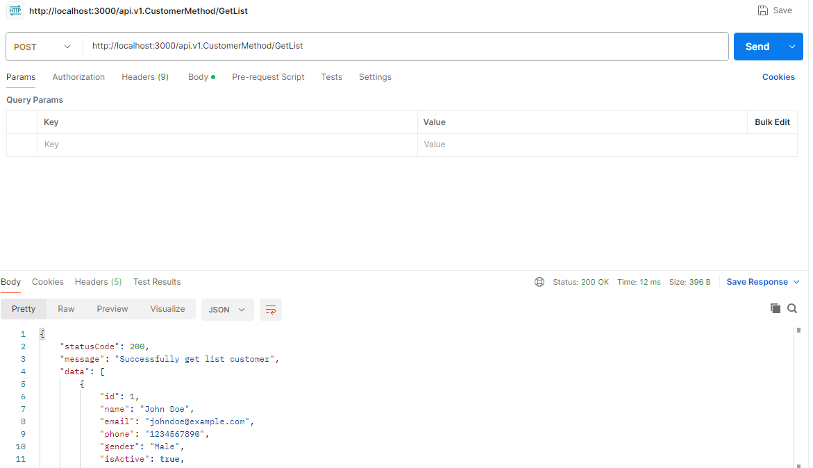
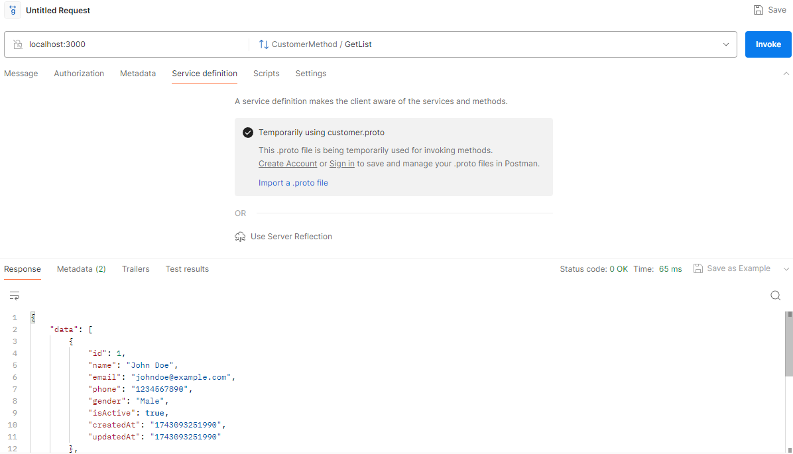

# Hexagonal Architecture Go Grpc Template

## Tech Stack
- **Golang** - Main programming language
- **Golang-Migrate** - Utility for database migration
- **GORM** - ORM Framework for Golang
- **PostgreSQL** - Database
- **gRPC & Connect-go** - Communication protocol (GRPC)
- **Docker** - Containerization
- **Docker Compose** - Orchestration
- **Echo** - HTTP framework for Go
- **Open telemetry, Jaeger, Prometheus** - Observability (tracers and metrics)

Hexagonal Architecture, also known as **Ports and Adapters**, is a software design pattern that promotes a clear separation of concerns between the business logic and external systems (e.g., databases, APIs, or user interfaces). The core application is isolated from dependencies, making it easier to maintain, test, and extend.

## Key Components

### 1. **Core (Business Logic)**
- Contains the domain logic.
- Does not depend on external frameworks or infrastructure.

### 2. **Ports (Interfaces)**
- Define how the core application communicates with the external world.
- Act as an abstraction layer to decouple the core from implementation details.

### 3. **Adapters (Implementations)**
- Implement the ports to interact with external services like databases, APIs, or messaging systems.

## Primary vs. Secondary Adapters

- **Primary (Driving) Adapters:** Components that initiate actions in the system.
  - Examples: REST Controllers, CLI Handlers, Event Listeners.

- **Secondary (Driven) Adapters:** External dependencies that the system interacts with.
  - Examples: Database Repositories, Third-party APIs, Messaging Queues.

## Benefits of Hexagonal Architecture

- ✅ **Decoupling:** The business logic is independent of external technologies.
- ✅ **Testability:** Core logic can be tested without dependencies like databases.
- ✅ **Flexibility:** Easily swap database, UI, or external services without modifying the core.
- ✅ **Maintainability:** A well-structured codebase that is easier to extend and refactor.

## Getting Started
Go version: 1.24.1

If you use SSH, use this command to configure your local Go environment to use SSH instead of HTTPS:
```
git config --global url."git@github.com:".insteadOf "https://github.com/"
```

## Build & Run
Makesure, postgres server, otel server is running, you can do it with
```
make docker-compose-up-wo-ap
```
After that, to run this app, run the following command:
```
make run
```

## Migrations
We use github.com/golang-migrate/migrate for migrations. All SQL migrations are stored in the `migrations` directory. To create a new migration file:
```
make migration name=<some_descriptive_filename>
```

This will create 2 files, up and down. Example: `20230303101454_create_customers_table.up.sql` and `20230303101454_create_customers_table.down.sql`.

Up files are used to construct the latest database schema version. Down files are used to deconstruct or rollback to previous schema version.

To execute SQL migrations in the `migrations` directory, run the following command:
```
make migrate-up
```

## Project Structure

### cmd
Entry point for applications, including CLI applications like `migrate` and `main`.

### config
Contains the app configuration from environment variable, injected from .env.

### internal

- **adapters**: Contains all implementation from interface (secondary / Implementations of ports that connect to actual systems), util, types, errors, infrastructure
    - **errors**: Contains errors defined in application.
    - **infrastructure**: Data Access Object. Structs declared here should represent database tables and will be generated into `query` package by `gorm.io/gen`
    - **primary**: Contains implementations of primary. These are the entry points that initiate requests to the application. They "drive" the application by calling the core logic. eg: grpc, http, graphql, etc.
    - **secondary**: Contains implementations of secondary. These are external dependencies that the core application interacts with, like databases, APIs, and message brokers.
    - **service**: Contains implementations of domain related business logic.
    - **types**: Contains types or constant defined in application.
    - **util**: Contains helper function.
- **ports**: Interfaces that define interactions between the core and external systems
  - **primary**: Contains interface of primary. These are the entry points that initiate requests to the application. They "drive" the application by calling the core logic. eg: grpc, http, graphql, etc.
  - **secondary**: Contains interface of secondary. These are external dependencies that the core application interacts with, like databases, APIs, and message brokers.
  - **service**: Contains interface of domain related business logic.

### migrations
Contains SQL migration files, with format `<yyyymmddhhmmss>_<filename>.<up|down>.sql`. Up files are used to construct the latest database schema version. Down files are used to deconstruct or rollback to previous schema version.

Up files will be executed from the earliest timestamp, Down files will be executed from the latest timestamp.

### proto
Contains proto for grpc (.proto file and .go generated from .proto using protoc)


## Tests

### Prerequisites
- Mockery: `go install github.com/vektra/mockery/v2@latest`

### Mock Files
To generate, mocks for accessor and service interfaces, run:
```
make mock
```

### Running the Tests
Just run
```
make test
```

## Testing Manually GRPC and HTTP
After running, you can test it using curl for Rest API :
```
curl --location 'http://localhost:3000/api.v1.CustomerMethod/GetList' \
--header 'Content-Type: application/json' \
--data '{"search": ""}'
```

Or you can test it using Postman

Test REST API :


Test GRPC :


## I hope this hexagonal architecture boilerplate will be useful for you.
